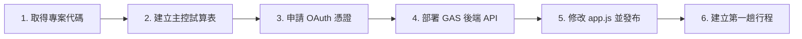

# ✈️ 雲端旅遊手冊 · 多行程漫遊手帳 (公版自架指南)

> 專為親友團員與旅人打造的通用型雲端旅遊手冊。結合日式雜誌美學排版、Google 雲端即時同步、多行程切換與彈性權限控管。  
> **本專案完全開源且支援公版自架**：只要擁有免費的 **Google 帳號** 與 **GitHub 帳號**，完全不需支付任何伺服器費用，約 10 分鐘即可架設屬於您與親友的專屬旅遊手冊網站！

---

## 🌟 核心特色與亮點

- 📱 **日式雜誌風排版**：採用和紙、苔綠、暖金色調與優雅字型，手機瀏覽體驗極佳。
- 🔄 **多行程漫遊樞紐 (Trip Hub)**：一套網站同時管理多趟旅程，支援網址參數（如 `?trip=okayama-2027`）直接分享與切換。
- 🔒 **三層角色與權限管理**：
  - **訪客模式 (Guest)**：未登入亦可瀏覽標記為公開的行程。
  - **團員模式 (User)**：透過 Google 帳號一鍵登入，僅能檢視被授權的專屬私密行程。
  - **管理員模式 (Admin)**：享有完整後台管理權限，可直接在網頁端增修行程、管理授權名單與上傳景點照片。
- 🛡️ **安全後端架構**：Google Apps Script (GAS) 後端透過 Google OAuth2 進行 Token 與 Audience 防偽驗證，並在回傳前端時隱蔽實體 Google Sheet ID 與 Drive Folder ID。
- ☁️ **完全零伺服器成本**：前端託管於 **GitHub Pages**，後端運算依賴 **Google Apps Script**，資料與圖片儲存於 **Google 雲端試算表與 Google Drive**。

---

## 👥 角色與權限對照表

| 功能項目 | 訪客 (Guest) | 授權團員 (User) | 系統管理員 (Admin) |
| :--- | :---: | :---: | :---: |
| **瀏覽公開行程** | ✅ | ✅ | ✅ |
| **瀏覽專屬私密行程** | ❌ | ✅ (依授權名單) | ✅ (檢視全部) |
| **行前準備清單打勾 (本機)** | ✅ | ✅ | ✅ |
| **景點時間軸與美食地圖導航** | ✅ | ✅ | ✅ |
| **切換大字體 / 夜間護眼模式** | ✅ | ✅ | ✅ |
| **進入行程編輯後台** | ❌ | ❌ | ✅ |
| **一鍵建立與初始化新行程** | ❌ | ❌ | ✅ |
| **上傳景點照片至 Google Drive** | ❌ | ❌ | ✅ |
| **編輯團員授權名單 (Allowed Users)** | ❌ | ❌ | ✅ |

---

## 📂 專案檔案結構

| 檔案名稱 | 角色說明 | 自架時是否需修改 |
| :--- | :--- | :--- |
| `index.html` | 手冊網頁主體架構、日式雜誌視覺樣式 (CSS) 與後台彈窗元件 | 否（預設已調校完成） |
| `app.js` | 前端核心邏輯（Google 登入驗證、路由切換、資料渲染、後台編輯互動） | **是**（需填入您的 Client ID 與 GAS 網址） |
| `gas-code.js` | 部署於 Google Apps Script 的雲端後端程式碼（權限驗證、試算表讀寫、Drive 圖片上傳） | **是**（需貼至 Google 雲端並填入主試算表 ID） |
| `.gitignore` | 設定 Git 忽略上傳的暫存與環境檔案 | 否 |
| `README.md` | 本專案詳細操作與自架維護說明手冊 | 否 |

---

## 🎯 自架必填設定速查清單 (Cheat Sheet)

為了讓您的旅遊手冊正常運作，請確認以下 **4 處關鍵設定**皆已替換為您自己的資訊：

| # | 設定檔案 / 平台 | 具體位置 | 需填入的內容 | 取得方式 |
| :-: | :--- | :--- | :--- | :--- |
| **1** | `app.js` | 第 4 行 `GOOGLE_CLIENT_ID` | 您的 Google OAuth Client ID | Google Cloud Console 憑證頁面 |
| **2** | `app.js` | 第 5 行 `GAS_API_URL` | 您的 Google Apps Script 網頁應用程式網址 | GAS 部署後的 Web App URL (`/exec`) |
| **3** | `gas-code.js` | 第 9 行 `MASTER_SHEET_ID` | 主控 Google 試算表 ID | Google 雲端 Master Sheet 網址 `/d/` 後方字串 |
| **4** | `gas-code.js` | 第 12 行 `GOOGLE_CLIENT_ID` | 您的 Google OAuth Client ID | 與 `app.js` 中的 Client ID 相同 |

---

## 🛠️ 完整自架與部署流程 (6 個階段)



---

### 階段一：取得公版專案代碼

1. **下載或 Fork 專案**：
   - 點擊本 GitHub 倉庫右上角的 **Fork** 按鈕將專案複製到自己的 GitHub 帳號；或點擊 **Code ➔ Download ZIP** 下載並解壓縮。
2. **開啟專案目錄**：
   - 使用您習慣的編輯器（如 Antigravity IDE、VS Code 或一般純文字編輯器）開啟專案資料夾。
   - 確認資料夾內已包含 `index.html`、`app.js`、`gas-code.js` 等核心檔案。

---

### 階段二：建立 Google 雲端主控資料庫 (Master Sheet)

1. 開啟 [Google 雲端硬碟](https://drive.google.com/)，建立一個全新的 Google 試算表，命名為 `Trip Master Database`。
2. 建立第一個工作表（分頁），名稱改為 **`Trips`**，在第 1 列設定以下 5 個標題欄位：
   - `A1`: `uuid`（行程代碼，例如 `okayama-2027`）
   - `B1`: `name`（行程名稱，例如 `日本岡山·山陰山陽七日漫遊`）
   - `C1`: `sheet_id`（該行程對應的專屬 Google Sheet ID）
   - `D1`: `folder_id`（該行程存放照片的 Google Drive 資料夾 ID）
   - `E1`: `allowed_users`（授權團員 Email，以逗號分隔；若為公開行程可填 `*` 或留空）
3. 建立第二個工作表（分頁），名稱改為 **`Admins`**，在第 1 列設定標題欄位：
   - `A1`: `email`
   - `A2`: 輸入您自己的 Google 帳號 Email（例如 `admin1@gmail.com`）
   - 💡 **支援多位管理員協作**：若有其他共同主辦人或副領隊，只需在 A 欄向下逐列新增即可（如 `A3: admin2@gmail.com`、`A4: admin3@gmail.com`）。後端系統會自動巡覽整欄名單，隨時在試算表增刪名單皆會**即時生效**，不需重新部署！
4. 記下瀏覽器網址列中的 **主試算表 ID (MASTER_SHEET_ID)**（即 `/d/` 與 `/edit` 之間的那串英數字）。

---

### 階段三：申請 Google OAuth 2.0 登入門禁憑證

為了讓網站能夠辨識管理員與授權團員，需要向 Google 申請免費的登入用戶端 ID：

1. 前往 [Google Cloud Console](https://console.cloud.google.com/)。
2. 建立一個新專案（例如命名為 `My Travel Portal`）。
3. 前往左側選單 **「API 和服務」 ➔ 「OAuth 同意畫面」**：
   - 使用者類型選擇 **「外部 (External)」**，點擊「建立」。
   - 填寫 **應用程式名稱**（如 `雲端旅遊手冊`）與 **使用者支援電子郵件**、**開發人員聯絡資訊**，其餘欄位留空，一路點「儲存並繼續」直到完成。
4. 前往左側選單 **「憑證」**，點擊上方 **「＋建立憑證」 ➔ 「OAuth 用戶端 ID」**：
   - **應用程式類型**：選擇 **網頁應用程式 (Web application)**。
   - **名稱**：自訂（例如 `Travel Portal Web Client`）。
   - **已授權的 JavaScript 來源** 點擊「＋新增 URI」加入：
     - 本機測試：`http://localhost`
     - 本機測試：`http://127.0.0.1`
     - 線上部署：`https://您的GitHub帳號.github.io`
5. 點擊「建立」後，複製彈出視窗中的 **用戶端 ID (GOOGLE_CLIENT_ID)**（格式如 `xxxx-xxxx.apps.googleusercontent.com`）。

---

### 階段四：建立並部署 Google Apps Script 後端 API

現在您手邊已具備專案內的 `gas-code.js` 以及前兩階段取得的 `MASTER_SHEET_ID` 與 `GOOGLE_CLIENT_ID`，可一次性完成後端部署：

1. 前往 [Google Apps Script 儀表板](https://script.google.com/)，點擊左上角 **「新專案」**。
2. 刪除編輯器內的預設程式碼，開啟您在階段一下載的 **`gas-code.js`**，將內容**全部複製並貼入** GAS 的 `代碼.gs` 中。
3. 修改程式碼最上方的 2 個常數設定：
   ```javascript
   // 1. 填入階段二取得的主控試算表 ID
   const MASTER_SHEET_ID = "您的_MASTER_SHEET_ID";

   // 2. 填入階段三取得的 Google OAuth Client ID
   const GOOGLE_CLIENT_ID = "您的_GOOGLE_CLIENT_ID.apps.googleusercontent.com";
   ```
4. 點擊右上角 **「部署」 ➔ 「新增部署」**：
   - 點選左側齒輪圖示，選擇 **「網頁應用程式 (Web App)」**
   - **說明**：`v1.0 Production`
   - **執行身分**：`我 (Me - 您的 Google 帳號)`
   - **誰有權限存取**：`任何人 (Anyone)` *(重要！務必選擇 Anyone)*
5. 點擊 **「部署」**，並依提示完成 Google 帳號安全性授權（點選「進階」➔「前往專案（不安全）」➔「允許」）。
6. 部署完成後，複製畫面上顯示的 **網頁應用程式網址 (GAS_API_URL)**。

---

### 階段五：修改前端設定並發布至 GitHub Pages

#### 1. 修改前端設定 `app.js`
開啟專案內的 `app.js`，修改最前方的兩行設定：
```javascript
// 填入階段三申請的 Google Client ID
const GOOGLE_CLIENT_ID = "您的_GOOGLE_CLIENT_ID.apps.googleusercontent.com";

// 填入階段四取得的 GAS 網頁應用程式網址
const GAS_API_URL = "https://script.google.com/macros/s/您的GAS部署ID/exec";
```
修改完成後請儲存 `app.js`。

#### 2. 在 GitHub 建立倉庫並推送
1. 登入 [GitHub](https://github.com/)，點擊右上角 **New**。
2. 輸入 **Repository name**（例如 `my-travel-portal`），選擇 **Public (公開)**。
3. 底下的 Initialize 選項（README、.gitignore 等）**全部不要勾選**，點擊 **Create repository**。
4. 開啟專案終端機（快捷鍵 `` Ctrl + ` ``），執行以下指令（將 `您的帳號` 替換為 GitHub 帳號）：

```bash
git add .
git commit -m "feat: 部署我的個人專屬雲端旅遊手冊"
git branch -M main
git remote add origin https://github.com/您的帳號/my-travel-portal.git
git push -u origin main
```

> [!TIP]
> **🤖 指令恐懼？讓 AI Agent 幫您一鍵代勞！**
> 
> 如果您不想手動輸入指令，可以直接複製下方提示詞貼給 AI Agent 助理：
> 
> > 「我已經在 GitHub 上建立好倉庫了，網址是 `https://github.com/您的帳號/my-travel-portal.git`。請幫我：
> > 1. 初始化此專案的 Git 並執行 Commit（訊息請使用繁體中文並遵循 Conventional Commits 規範）。
> > 2. 將專案關聯至上述遠端倉庫的 `main` 分支。
> > 3. 將程式碼推送到該遠端倉庫。」

#### 3. 啟動 GitHub Pages 免費發布
1. 前往 GitHub 倉庫頁面的 **Settings** ➔ 左側 **Pages**。
2. **Build and deployment** 下方的 **Source** 選擇 `Deploy from a branch`。
3. **Branch** 選擇 `main`，資料夾選擇 `/ (root)`，點擊 **Save**。
4. 等候 1~2 分鐘，重新整理頁面即可取得您的專屬旅遊手冊網址：  
   👉 `https://您的帳號.github.io/my-travel-portal/`

---

### 階段六：開箱啟用與建立第一趟行程

1. 用手機或電腦瀏覽器打開您的專屬手冊網址。
2. 點擊右上角 **「Google 登入」**，使用您在 Master Sheet `Admins` 填寫的 Google 帳號登入。
3. 登入成功後，畫面會辨識為 **管理員 (Admin)**，並出現 **「＋建立新行程」** 按鈕。
4. **建立行程前準備**：
   - 在 Google 雲端硬碟建立一個新的空白試算表（例如命名為 `2027 岡山之旅`），複製其 **Sheet ID**。
   - 在 Google 雲端硬碟建立一個新資料夾（用於存放照片），將共用權限設為「知道連結的使用者皆可檢視」，複製其 **Folder ID**。
5. 點擊網頁上的 **「＋建立新行程」**，填入行程名稱、UUID 代碼、Sheet ID、Folder ID 與授權團員 Email，點擊確認。
6. 後端系統會**自動為該空白試算表初始化所有欄位與分頁**（航班、住宿、每日行程、美食清單等），大功告成！

---

## 📄 授權條款

本專案採用 [MIT License](https://opensource.org/licenses/MIT) 授權釋出，歡迎自由修改、分享與發布！
